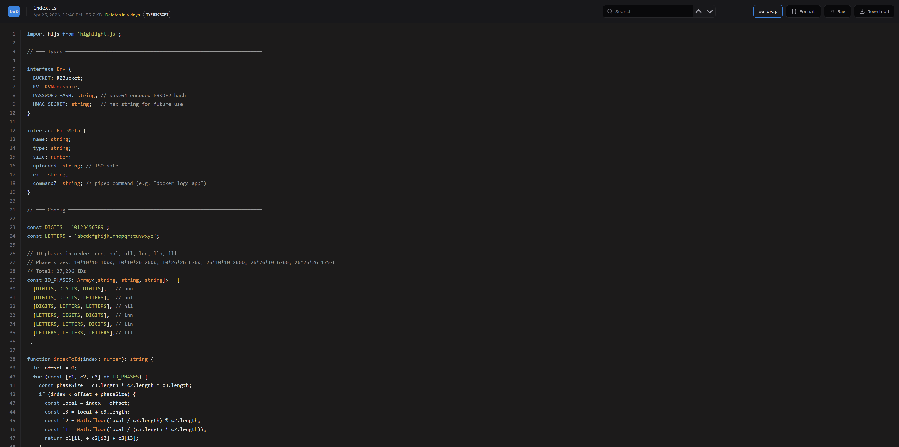
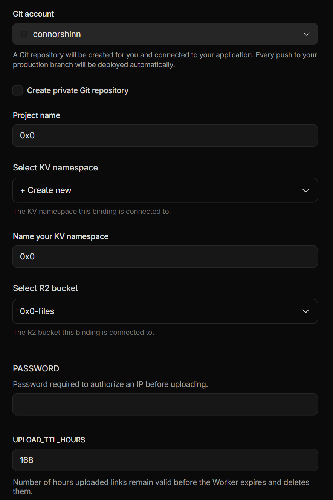

# 0x0

A minimal, self-hosted file hosting service modeled after 0x0.st and hosted on **Cloudflare Workers + R2 + KV**. Upload files, paste text, or pipe command output and get a short URL to view the output in your browser.



## Key Features

### Security
- **IP-based auth**: to prevent unauthorized uploads, 0x0.gg includes a one-time authorization per IP address.
- **Rate limiting**: auto-bans IPs after 5 failed password attempts (24h ban)
- **Configurable retention**: includes a variable to control when links expire (and uploaded files are deleted)

### Upload Process:
- **Upload via CURL or Custom Command**: supports uploading via standard CURL command (e.g., `curl -sF "file=@$1" https://your-worker.workers.dev/`), with option to setup a simplified command (e.g., `0x0 ./wrangler.toml`)
- **Short URLs**: sequential 3-character IDs are provided to simplify URL syntax.

## File Viewer
- **Syntax highlighting**: leverages highlight.js to automatically format common file types
- **Robust code viewer**: line numbers, word wrap toggle, zoom (Ctrl+/−), search (Ctrl+F), select all (code only)
- **Format toggle** — pretty-prints inline JSON, XML, and key=value pairs in logs
- **URL linkification** — clickable URLs in code
- **Image preview** — inline image viewer for image uploads
- **Raw / download** — `/raw` and `/dl` endpoints for every file

## One-Click Deploy
[](https://deploy.workers.cloudflare.com/?url=https://github.com/connorshinn/0x0.gg)


Click the button above to deploy to your Cloudflare account. Configuration page allows you to modify key settings prior to deployment.  



Click the button above to deploy to your Cloudflare account. Cloudflare will automatically provision the R2 bucket and KV namespace.

### Custom Domain
- Once deployment is complete, you can access your application using the URL provided by Cloudflare (which is based on the project name you set during configuration). For example: `0x0.connor-shinn.workers.dev`

- If desired, you can also setup your own domain:  
  - Purchase a custom domain from any registrar and add it to Cloudflare
  - Once added, navigate to the [Workers page](https://dash.cloudflare.com/?to=/:account/workers-and-pages) in Cloudflare and select your worker
  - Click Settings at the top of the page, then press "Add" at the top of the "Domains & Routes" section. 
  - Click "Custom Domain" in the sidebar that appears, and then enter your domain. 
  - Once your domain is added, click the "Add" button again, but select "Route" instead. On the next page, select your domain from the Zone dropdown, and then enter `[YourDomain]/*` as the Route (e.g., `0x0.gg/*`). Finish by clicking "Add Route" at the bottom of the sidebar
  - Confirm the domain is working by opening the domain name in a new tab (e.g., `http://0x0.gg`). If you see a landing page, everything is setup and ready to go. 


## Using the Program

### Authorize
- Prior to uploading files, you will need to authenticate your IP address using the command below. Replace `[PASSWORD]` with the password you set when you initially configured the app in Cloudflare, and `[WORKER_URL]` with your actual worker URL or custom domain URL. 

```bash
curl -d "p=[PASSWORD]" [WORKER_URL]/auth
```

### Upload a file

```bash
curl -F "file=@photo.png" [WORKER_URL]
```

### Pipe stdin

```bash
docker logs my-app | curl -sF "file=@-" [WORKER_URL]
```

### Pipe command output or upload a file

- Optionally, add this to your `.bashrc` / `.zshrc`:

```bash
0x0() {
  if [ "$#" -eq 1 ] && [ -f "$1" ]; then
    curl -sF "file=@$1" https://your-worker.workers.dev/
  else
    "$@" | curl -sF file=@- -F "cmd=$*" https://your-worker.workers.dev/
  fi
}
```

Then:

```bash
0x0 ./wrangler.toml
0x0 docker logs my-app
0x0 kubectl get pods
0x0 cat /var/log/syslog
```

### Delete a file

```bash
curl -X DELETE [WORKER_URL]/abc
```


## Architecture

| Component | Purpose |
|-----------|---------|
| Worker | Request routing, auth, rate limiting, HTML rendering |
| R2 | File blob storage (no egress fees) |
| KV | IP allowlist, file metadata, rate limit counters, ID counter |

## Cost

On Cloudflare's free tier:

- **Workers**: 100k requests/day
- **R2**: 10 GB storage, no egress fees
- **KV**: 100k reads/day, 1k writes/day

For personal use, this is effectively **free**
